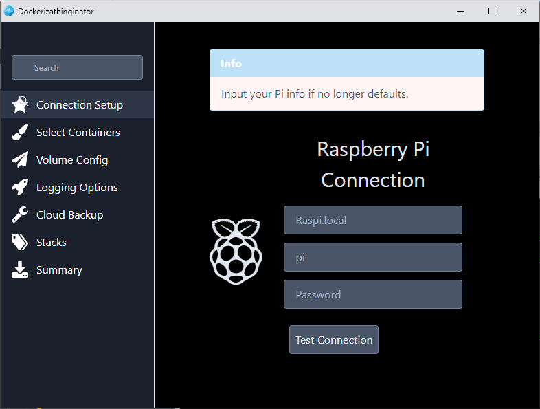

# dockerizathinginator

Basically, it's a dockerizathinginator...


### [](#header-3) License

This is software is free and open source. It does however use the [GPLv3.0 License](https://www.gnu.org/licenses/gpl-3.0.en.html). 

Author: b34rdtek
Twitter: [b34d_tek](https://twitter.com/b34d_tek)

### [](#header-3) Project Idea

The idea behind this project is to have a way to configure your Raspberry Pi 4 remotely from your system after flashing. This tool will install docker requirements, setup portainer, and then build stacks via the UI using the portainer api on your raspberry pi. Basic idea is to work like a wizard to configure all items, then when you are ready it connects to Pi and makes changes while displaying a status bar in a modal.

More to come soon as this project just started :-D

Current Layout:



### [](#header-3) Downloading
The current build is listed under releases. You can also download here:

[Latest Build](https://github.com/b34rdtek/dockerizathinginator/releases/download/ALPHA/dockerizathinginator.exe)

---As of this build, core functionality is not setup, nore does the application correctly run---

### [](#header-3) Contributing

If you wish to contribute, modify, or do whatever fork, clone etc and create virtualenv then install requirements.

Just go to your system and clone

```
$ git clone https://github.com/b34rdtek/dockerizathinginator.git
```

Next make sure to setup a virtualenv

```
$ virtualenv .
```

Finally, enter virtualevn and install requirements.txt

```
$ source bin/activate

(or if on windows)

$ Scripts/activate

(dockerizathinginator) $ pip install -r requirements.txt
```

To execute

```
(dockerizathinginator) $ python dockerizathinginator.py
```

### [](#header-3) Building

To build your own standalone file you just need to execute the following in virtualenv:

```
(dockerizathinginator) $ python -m eel dockerizathinginator.py web --onefile --noconsole
```
